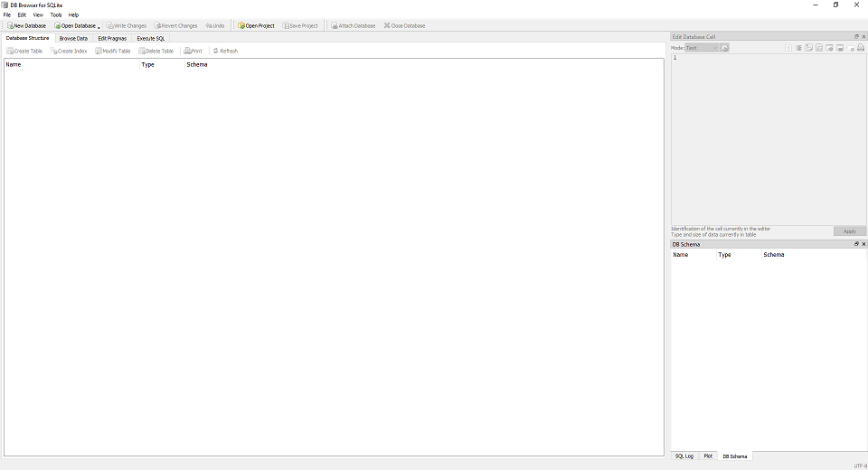
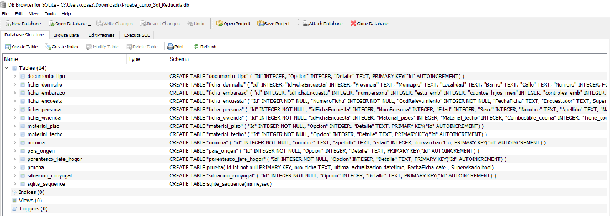

# Curso de Introducción a las Bases de Datos
En este repo vamos a tener todo lo relacionado con el curso, desde la presentación general, hasta la base SQLite que usaremos durante el taller. Vamos a por ello!


### PPT
La presentación del curso es un PPT que pueden descargar desde
[AQUÍ](https://github.com/SIEMPROpaez/tallerBBDD/blob/b2d63b55526d671543b98ee9b3419be1c51a308b/ppt/Curso%20introducci%C3%B3n%20base%20de%20datos.pptx)


### Base de prueba para el curso
A lo largo del curso usaremos una base de prueba para realizar los ejercicios. Pueden descargarla desde [AQUÍ](https://github.com/SIEMPROpaez/tallerBBDD/blob/e6755ff8f47f1aa6b4103a94aa9665a490580bfc/base/Prueba_curso_Sql_Reducida.db) y guardarla en la carpeta que gusten.


### Manager del SQLite
El manager para SQLite lo podrán descargar desde [AQUÍ](https://download.sqlitebrowser.org/DB.Browser.for.SQLite-v3.13.0-win64.zip). Pueden descomprimirlo en la carpeta Descargas de sus máquinas o en la carpeta que gusten. Luego entran a la carpetaq extraída, hacen doble click en **DB Browser for SQLite.exe** y listo, ya tienen el manager funcionando! 

Van a ver lo siguiente



Arrastran el archivo **Prueba_curso_Sql_Reducida.db** que descargaron y listo, todo andando!




### Tenemos una Wiki
Pueden consultarla [AQUÍ](https://github.com/SIEMPROpaez/CursoBBDD/wiki)


### Correo de contacto
Si tienen dudas, consultas y/o sugerencias pueden escribirme a 

```
cpaez@siempro.gob.ar
```
